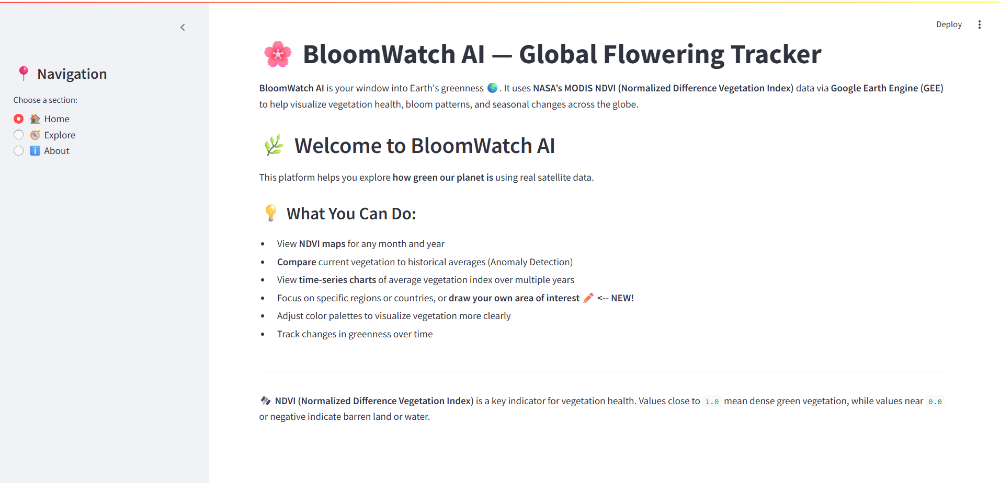

# BloomWatch AI 🌸

**Real-Time Global Vegetation Analysis and Anomaly Detection**


BloomWatch AI is an interactive web application developed for the**NASA Space Apps Challenge** to monitor the health and seasonal changes of global vegetation using NASA satellite data. It provides instant anomaly detection and long-term time-series analysis, empowering users to track environmental changes without needing specialized GIS software.


-----


## Table of Contents

[Important Links](#important-link)
1.  [🚀 Challenge and Theme](https://www.google.com/search?q=%23-challenge-and-theme)
2.  [✨ Key Features](https://www.google.com/search?q=%23-key-features)
3.  [💻 Technologies Used](https://www.google.com/search?q=%23-technologies-used)
4.  [🛰️ NASA Data & Resources](https://www.google.com/search?q=%23-nasa-data--resources)
5.  [🛠️ Getting Started](https://www.google.com/search?q=%23-getting-started)
6.  [💡 Project Summary](https://www.google.com/search?q=%23-project-summary)

-----
## Important Links 
1. [Global Nasa Hackathon](https://www.spaceappschallenge.org/)
2. [2025 Challeneges](https://www.spaceappschallenge.org/2025/challenges/)
3. [Team- Last Minute Runner ](https://www.spaceappschallenge.org/2025/find-a-team/last-minute-runner/)
4. [Project Detail](https://www.spaceappschallenge.org/2025/find-a-team/last-minute-runner/?tab=project)
5. [Demo Video](https://drive.google.com/drive/folders/1-7hZXwryBJ31XH0xU2vz-5jMwnJuLciW)


## 🚀 Challenge and Theme
This project addresses the **BloomWatch** challenge. 
The goal was to create an accessible tool that utilizes satellite imagery to monitor and analyze changes in global vegetation cover, specifically focusing on **identifying anomalies** (unusual greening or drying) that indicate environmental stress or major bloom events.

-----

## ✨ Key Features

BloomWatch AI provides a simple, structured interface (using Streamlit Tabs) to access complex geospatial analysis:

  * **Anomaly Detection:** Instantly calculates and visualizes the difference between the **current year's** and a **historical reference year's** vegetation index (NDVI/EVI). This highlights areas that are significantly **greener (positive anomaly)** or **drier (negative anomaly)**.
  * **NDVI/EVI Time-Series Trend:** Generates a clean, interactive line chart showing the **long-term average index value** for any selected region across a range of years, aiding in climate trend analysis.
  * **Flexible Area of Interest (AOI):** Allows users to select regions by name or use the integrated **Folium drawing tools** (pencil icon on the map) to define and analyze any custom geographic area.
  * **Interactive Mapping:** Provides dynamic visualization of NDVI and EVI layers with customizable color palettes.

-----

## 💻 Technologies Used

| Category | Tool / Language | Role in Project |
| :--- | :--- | :--- |
| **Data Platform** | **Google Earth Engine (GEE)** | Cloud computing platform for processing large-scale satellite data. |
| **Primary Language** | **Python** | Core logic and data manipulation. |
| **Web Framework** | **Streamlit** | Built the fast, interactive, and user-friendly web application interface. |
| **Mapping** | **geemap** (Folium backend) & **folium.plugins** | Interactive map creation and integration of user drawing tools. |
| **Libraries** | **Pandas, NumPy** | Data preparation and statistical analysis for charts. |

-----

## 🛰️ NASA Data & Resources

To be eligible for the Global Award, BloomWatch AI relies entirely on open NASA satellite data products:

| Resource Name | Data Used | Link |
| :--- | :--- | :--- |
| **MODIS/Terra Vegetation Indices (MOD13Q1 V6.1)** | **NDVI** and **EVI** layers (250m resolution) for all time-series and anomaly calculations. | `https://doi.org/10.5067/MODIS/MOD13Q1.061` |
| **GEE Data Catalog** | The cloud-hosted access point for querying and processing the MODIS product. | `https://developers.google.com/earth-engine/datasets/catalog/MODIS_061_MOD13Q1` |
| **NASA Earthdata** | Core documentation and scientific context for Vegetation Indices. | `https://www.earthdata.nasa.gov/topics/biosphere/vegetation-index` |

-----

## 🛠️ Getting Started

### Prerequisites

1.  **Python** (3.8 or higher)
2.  **Google Earth Engine (GEE) Account:** You must have initialized Earth Engine on your system.

### Installation

1.  Clone this repository:

    ```bash
    git clone https://github.com/muhammadfahd/Bloom-Watch-AI.git
    cd Bloom-Watch-AI
    ```

2.  Install the required Python packages:

    ```bash
    pip install -r requirements.txt
    # Alternatively, manually install the main dependencies:
    # pip install streamlit geemap pandas numpy ee
    ```

3.  Ensure your Earth Engine credentials are set up (if running for the first time outside a GEE environment):

    ```bash
    ee authenticate --google
    ```

### Running the App

Run the Streamlit application from your terminal:

```bash
streamlit run bloomwatchai.py
```

The app will open automatically in your web browser.

-----

## 💡 Project Summary

BloomWatch AI provides a powerful and intuitive platform for environmental monitoring. It successfully integrates complex GEE geospatial analysis (including the fixed caching issues for unhashable geometries) into a user-friendly web interface, making high-value NASA data accessible to a global audience for tracking climate impacts and bloom dynamics.